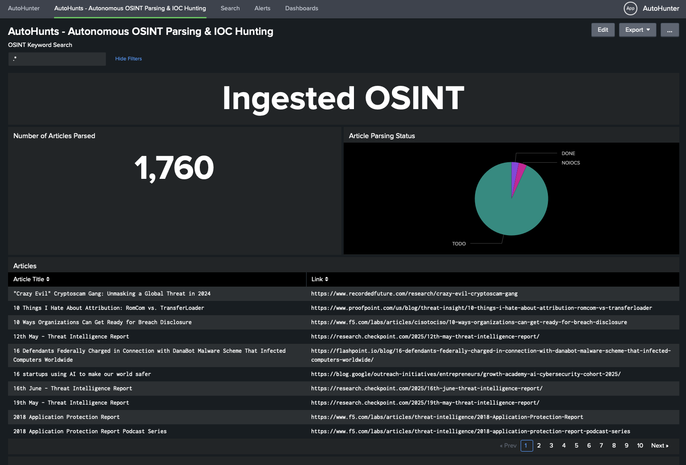

# AutoHunter

AutoHunter is a collection of custom Splunk commands and dashboards that serve to quickly ingest and extract IOC data from online articles. Once extracted, the IOCs are then instantly hunted in various telemetry sources.

> NOTE: Elements of the main dashboard use the `askllama` command to summarize articles using a local LLM, you can install the command here if you'd like to use this functionality: https://github.com/ben3636/splunk-llama

## Initial Setup & Basic Usage
For basic autohunting by pasting a URL into the main dashboard (`AutoHunter`), there is no setup required. This should be ready to go out of the box. Notice there is a `mode` option that defaults to `normal`. This should be fine in most cases but if you find that your URL isn't returning results you will need to switch to `advanced` mode which requires a Selenium API to be specified. The difference between `normal` and `advanced` mode is covered in detail in the later technical portion of this README.

The second dashboard in the app (`AutoHunts`) is the hub for `Autonomous Hunting`. Feel free to reread that sentence again, it gives me chills every time. This functionality is made possible by AutoHunter's sister app, `RSS Streamer`. RSS Streamer (https://github.com/ben3636/splunk-rss) allows you to specify RSS feeds in a lookup and Splunk will automatically ingest the feed data to a stash index. AutoHunter can then collect all the links to the articles from this data, start reading the articles, extracting the IOCs, and performing hunts autonomously (the crowd gasps). Neat trick right? AutoHunter is a beast on her own but when she teams up with her sister they're a force to be reckoned with. 

AutoHunter has scheduled searches available out of the box that look for RSS data so all you need to do is enable them, install RSS Streamer, and manually run its "Pull RSS Feeds" scheduled search after you've reviewed the feeds lookup and made any desired changes. That "Pull RSS Feeds" scheduled search is disabled by default but if the feeds look good feel free to kick that on so it pulls fresh OSINT in on its own. Once RSS data is in pop back over to AutoHunter's `AutoHunts` dashboards and within an hour you should see it acknowledging the RSS articles and queuing them up for parsing. 

AutoHunter has a few scheduled searches that make the magic happen including:

1. Checking the RSS stash index for new articles
2. Performing a `normal` pass at new articles attempting to read and extract any IOCs
3. Performing a secondary fallback pass with `advanced` mode (Selenium) for any articles that `normal` mode was not able to handle
4. Performing housekeeping on the IOC lookup to remove duplicate entries
5. Hunting the IOCs stored in the lookup in various datasources (network, web, dns, etc)
6. Notifying you via webhook when a new article is processed and if any IOCs were found in it (optional, I send this to a muted Discord channel I can pop into from time to time to see if it's hunted something already)
7. Alerting you of any actual IOC findings within your environment. This will send an alert to the webhook or other alert action you configure with basic information about the IOC and impacted asset.

> NOTE: For a complete walkthrough on getting autonomous hunting up and running from a stock Splunk instance, watch the demo video below

## Demo
https://drive.google.com/file/d/1LthJq1NksqcL6FbdTk-SsJRgvjyxL7Et/view?usp=share_link

https://drive.google.com/file/d/12mVLEtFxBs5_Jraz8Xf_aMuzLSFCtbOJ/view?usp=sharing

## Technical Stuff - What Happens Behind the Curtain
The app's core ability to read web content is driven by the `webreader` command. This takes a few arguments such as URL and mode and grabs the contents of the specified article so the IOC extraction regex monster can sniff out those sweet sweet IOCs.

While using the main dashboard and/or the `webreader` command directly, you will notice the `mode` parameter. This determines how the remote content is retrieved. Normal mode uses Python's basic requests to retrieve the content and BeautifulSoup for text parsing. This is fast and ideal for basic parsing and will run right on the Splunk instance natively.

If an article's content is not being retrieved in normal mode, there may be a Javascript requirement or some kind of webscraping protection. If this is the case you'll need to use advanced mode. Advanced mode passes the responsibility of retrieving the web content off to a Selenium API. You'll need to setup something like Selenium Grid for this. When I say setup I mean pull down and start a Selenium docker container and expose the API port, it takes all of 60 seconds.

> Example Selenium container: docker run -d -p 4444:4444 --shm-size=2g selenium/standalone-chrome

> API for above container would be http://\<IP\>:4444/wd/hub

## Webreader Command Usage
The `webreader` command is the heart of the product. It takes a `url` argument and retrieves the contents of the article. Specifically how this is done depends on whether you specify `mode=normal` or `mode=advanced`. Remember, if you're using advanced mode you'll need to specify `selenium_server` so `webreader` knows where to contact Selenium.

Below are some examples of how you can use `webreader` to ingest the content of online articles directly into Splunk:

Normal Mode
> | webreader url="\<URL\>" mode=normal

Advanced Mode
> | webreader url="\<URL\>" mode=advanced selenium_server="http://\<IP\>:4444/wd/hub"

`webreader` in its basic form is a generating command because it will be the first command in your search. Sometimes you may encounter instances where you already have a search with results containing a link in each event. If this is the case, an alternate version of `webreader` is available called `streamingwebreader`. `streamingwebreader` takes the same arguments as `webreader` but it is a streaming command and can be used during an existing search to use links present in event fields. Instead of passing an actual URL in the `url` argument, simply use the field name that contains the links in your events:

> | makeresults | eval link="https://google[.]com" | streamingwebreader url=link mode=normal

This functionality is key for the integration with AutoHunter's sister app, RSS Streamer so the app can autonomously ingest fresh OSINT and action it without any human interaction.

## Autonomous Operation - OSINT's Journey from Start to Finish
AutoHunter can automatically read, extract IOCs from, and hunt articles from RSS data from RSS Streamer (https://github.com/ben3636/splunk-rss). This process leverages the `streamingwebreader` command and the scheduled searches included in the app. I've listed out the general flow by which this happens below:

1. RSS data is ingested from RSS Streamer, landing in a stash index
2. AutoHunter parses this index and builds a lookup of article titles and links (`autohunter_article_log.csv`)
3. AutoHunter performs a first pass analysis on the links using `normal` mode and attempts to extract IOCs (regex is stored in the `extract_iocs` macro)
4. If the article was unable to be parsed with `normal` mode the article will be flagged as `TORETRY` in `autohunter_ioc_log.csv`
5. A second scheduled search passes over `autohunter_ioc_log.csv` for articles that were unable to be parsed with `normal` mode (marked as `TORETRY`)
6. These remaining articles are parsed using `advanced` mode and IOCs are extracted. If AutoHunter was able to extract IOCs from the article at this point, the article is marked as `DONE` in `autohunter_ioc_log.csv`. If there is still no yield from extraction, it is marked with `NOIOCS`.
7. Extracted IOCs (stored in `autohunter_ioc_log.csv` are hunted by data type with the remaining scheduled searches and any findings are sent to you via webhook or whichever custom alert action you've setup.

Below is the default layout for the various scheduled operations:
1. Check for New RSS Articles - Start of every hour
2. Normal mode first pass at new OSINT - 10 minutes and 40 minutes past the hour
3. Advanced mode second pass at the new OSINT - 20 minutes and 50 minutes past the hour
4. IOC Lookup Cleanup - Start of each hour and 30 minutes past the hour
5. Various IOC hunts based on data type - Every 15 minutes
6. New hunt notification - Every 15 minutes
7. Alert for hunt findings - Every 5 minutes

> NOTE: It is normal to see some two-part statuses in the "Article Parsing Status" portion of the AutoHunts dashboard such as `TORETRY DONE` or `TORETRY NOIOCS`. This indicates some articles have gone through secondary extraction by advanced mode after the first normal mode pass. This double status goes away when the housekeeping scheduled search runs twice an hour to keep only the latest status tag for each article.

## Feature Preview & Final Thoughts
1. There are still some remaining hiccups with the IOC extraction regex for certain sites. I've taken care of the big ones but as I test the app on around 2000 articles things pop up here and there that will be addressed in future updates. 
2. I'm also aware some users will want to forego the use of advanced mode/Selenium. For the main dashboard/adhoc searching this isn't an issue. For the autonomous hunting feature, if you choose to not setup/enable the "second pass" scheduled search that attempts to parse the finicky RSS sources with `advanced mode` you will still get all of the extracted IOCs and hunting `normal mode` accomplishes in the first pass but any articles in the feeds that block normal mode will not be further parsed and hunted as they usually would. This will show up as a bunch of "TORETRY" statuses in the AutoHunts dashboard. This isn't a problem and is expected as the app has noted that those articles did not yield any IOCs with normal mode and would normally follow up with advanced as a final effort. This ensures there are actually no IOCs to extract from the article and it isn't just an issue of normal mode being blocked due to lack of Javascript/cookie support. Leaving the advanced mode scheduled search off is absolutely viable, just note that the status of articles will not reach their final state as either DONE or NOIOCS and will stay as TORETRY.
3. There are two sample Discord alert actions in the app out of the box. If you want to use these you just need to paste your webhook URL into each file in the app's bin directory. There are two so you can send actual findings to a monitored channel and the new hunt notifications to a muted channel for general reference.
4. There is now a `findings_exclusions` macro in the app that is called in all of the hunting searches. The app will extract all items matching IOC regex like IPv4 addresses but some may be irrelevant to hunt on such as `0.0.0[.]0` or `127.0.0[.]1`. I've already put some exclusions in there so you won't get alerted about things like internal addresses in your environment but feel free to add to this as you start seeing alerts.
